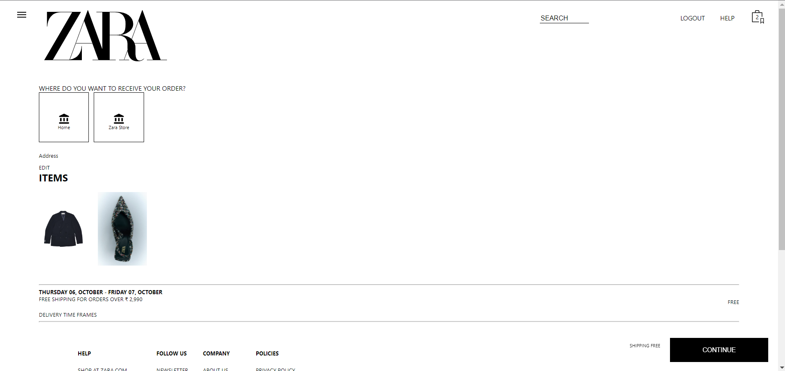
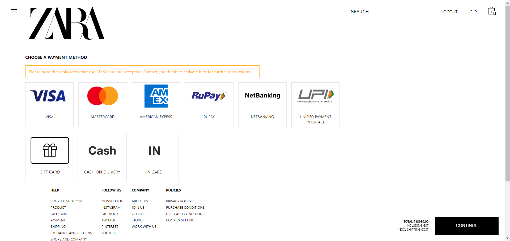

Introduction
ZARA Fashion is a Clothing website. ZARA Fashion is one of the e-commerce websites working in India. Launched in Galicia, Spain in 1975. ZARA slowly expanded its empire in the rest of the country and later in Portugal in 1988 and the year after that- in 1989 ZARA made it to the United States of America.

Tech Stack :
The tech Stack we used for creating this website are :-

1.HTML
2.CSS
3.Javascript
3.React
4.chakra ui
5.NodeJs

Landing Page :
The landing page of ZARA.com displays the navigation bar which contains menu bar , search button , helps , Login Cart. In our website, we tried our best to clone same as original website.

.png>)

.png>)

Menu Section :
We have added Menu section on the top left corner, if you click on the menu it will show the categories and subcategories of that section.

.png>)

.png>)

Login and Create Account :
You can see Login and Create Account page. We used some NPM packages to authorize and authenticate users. Here user can also login and logout to the website.

.png>)

.png>)

Payment Page :
We have added different payment methods, users can choose according to there preference, and after selecting any method it will redirect users to final payment page. Users have to provide OTP to verify their order which they received on their registered Email address.

Responsive :
Our website is responsive as well.

