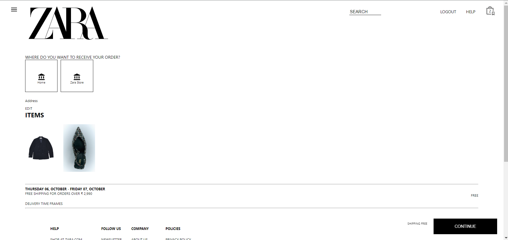
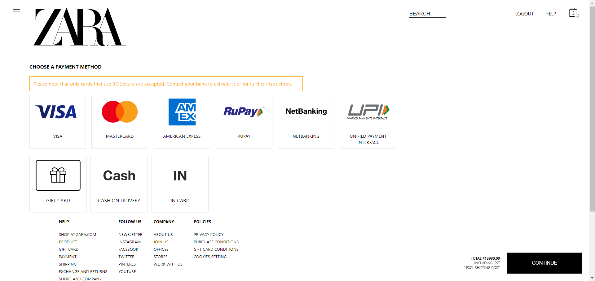

Introduction
ZARA Fashion is a Clothing website. ZARA Fashion is one of the e-commerce websites working in India. Launched in Galicia, Spain in 1975. ZARA slowly expanded its empire in the rest of the country and later in Portugal in 1988 and the year after that- in 1989 ZARA made it to the United States of America.

Let's walk you through some snapshots of the cloned site

HomePage
On the home page, the big hero picture you can see below represents the particular category type of clothes, similarly, can u see different category types every 2 seconds, since all the category types are kept in 2 seconds time intervals.

.png>)

.png>)

Navbar
The blow picture is the navbar, which has 3 sections and in each section, we have multiple categories/subcategories, if we click on any one of them, the user gets navigated to the Product Page.

.png>)

Login and create page

You can see Login and Create Account page. We used some NPM packages to authorize and authenticate users. Here user can also login and logout to the website.

.png>)

.png>)

Payment Page :
We have added different payment methods, users can choose according to there preference, and after selecting any method it will redirect users to final payment page. Users have to provide OTP to verify their order which they received on their registered Email address.

